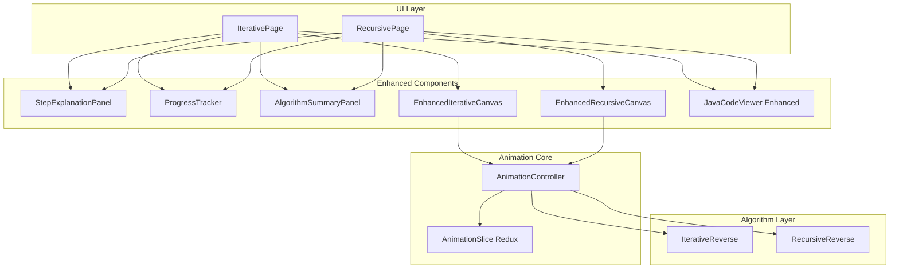

# Design Document

## Overview

本设计文档描述如何改进链表反转动画演示的可理解性。核心改进包括：增强步骤说明、改进指针可视化、添加进度指示、增强连接可视化、代码同步高亮、算法阶段说明，以及递归法可视化改进。

设计遵循渐进增强原则，在现有组件基础上进行改进，保持代码结构清晰和可维护性。

## Architecture



## Components and Interfaces

### 1. StepExplanationPanel 组件

增强的步骤说明面板，显示详细的操作解释。

```typescript
interface StepExplanation {
  operationName: string;      // 操作名称，如 "保存 next 指针"
  operationPurpose: string;   // 操作目的，如 "防止链表断裂后丢失后续节点"
  operationEffect: string;    // 操作效果，如 "next 现在指向节点 2"
  beforeState?: string;       // 变化前状态
  afterState?: string;        // 变化后状态
  highlightVariables: Array<{
    name: string;
    color: string;
    value: string;
  }>;
}

interface StepExplanationPanelProps {
  explanation: StepExplanation;
  isVisible: boolean;
}
```

### 2. ProgressTracker 组件

进度追踪器，显示当前步骤在整体流程中的位置。

```typescript
interface ProgressPhase {
  name: string;           // 阶段名称，如 "初始化"、"第1轮循环"
  startStep: number;      // 起始步骤
  endStep: number;        // 结束步骤
  color: string;          // 阶段颜色
}

interface ProgressTrackerProps {
  currentStep: number;
  totalSteps: number;
  phases: ProgressPhase[];
  onStepClick?: (step: number) => void;
}
```

### 3. AlgorithmSummaryPanel 组件

算法概述面板，提供宏观理解。

```typescript
interface AlgorithmSummaryPanelProps {
  method: 'iterative' | 'recursive';
  currentPhase: string;
  phaseDescription: string;
  isExpanded: boolean;
  onToggle: () => void;
}
```

### 4. 增强的 AnimationEvent 类型

扩展动画事件，包含更丰富的说明信息。

```typescript
interface EnhancedAnimationEvent extends AnimationEvent {
  explanation: StepExplanation;
  phase: string;              // 所属阶段
  phaseStep: number;          // 阶段内步骤编号
}
```

### 5. 增强的 IterativeCanvas 组件

改进指针和连接的可视化效果。

```typescript
interface AnimatedPointer {
  name: string;
  fromPosition: { x: number; y: number } | null;
  toPosition: { x: number; y: number };
  color: string;
  animationDuration: number;
}

interface ConnectionState {
  fromNodeId: number;
  toNodeId: number | null;
  state: 'normal' | 'breaking' | 'creating' | 'reversed';
  animationProgress: number;
}
```

### 6. 增强的 RecursiveCanvas 组件

改进递归调用栈和回溯过程的可视化。

```typescript
interface EnhancedCallStackFrame {
  params: { head: number | null };
  returnValue: number | null;
  state: 'calling' | 'executing' | 'returning';
  depth: number;
}

interface RecursivePhaseIndicator {
  phase: 'diving' | 'backtracking';
  currentDepth: number;
  maxDepth: number;
}
```

## Data Models

### Redux State 扩展

```typescript
interface EnhancedAnimationState extends AnimationState {
  // 新增字段
  stepExplanation: StepExplanation | null;
  currentPhase: string;
  phases: ProgressPhase[];
  connectionStates: Map<string, ConnectionState>;
  pointerAnimations: AnimatedPointer[];
  recursivePhase: 'diving' | 'backtracking' | null;
}
```

### 步骤说明数据结构

```typescript
// 迭代法步骤说明映射
const ITERATIVE_EXPLANATIONS: Record<string, (pointers: Pointers, nodes: ListNodeData[]) => StepExplanation> = {
  'INITIALIZE': (pointers, nodes) => ({
    operationName: '初始化指针',
    operationPurpose: '准备三个指针用于遍历和反转链表',
    operationEffect: `prev 指向 null，curr 指向头节点 ${getNodeValue(pointers.curr, nodes)}`,
    highlightVariables: [
      { name: 'prev', color: '#9c27b0', value: 'null' },
      { name: 'curr', color: '#2196f3', value: getNodeValue(pointers.curr, nodes) }
    ]
  }),
  'SET_NEXT_POINTER': (pointers, nodes) => ({
    operationName: '保存 next 指针',
    operationPurpose: '在断开 curr.next 之前，先保存下一个节点的引用',
    operationEffect: `next 现在指向节点 ${getNodeValue(pointers.next, nodes)}`,
    beforeState: `next = undefined`,
    afterState: `next = ${getNodeValue(pointers.next, nodes)}`,
    highlightVariables: [
      { name: 'next', color: '#ff9800', value: getNodeValue(pointers.next, nodes) }
    ]
  }),
  // ... 其他事件类型
};
```

### 阶段定义

```typescript
// 迭代法阶段定义
function generateIterativePhases(nodeCount: number): ProgressPhase[] {
  const phases: ProgressPhase[] = [
    { name: '初始化', startStep: 0, endStep: 0, color: '#4caf50' }
  ];
  
  let currentStep = 1;
  for (let i = 0; i < nodeCount; i++) {
    phases.push({
      name: `第${i + 1}轮循环`,
      startStep: currentStep,
      endStep: currentStep + 4, // 每轮5个步骤
      color: `hsl(${200 + i * 30}, 70%, 50%)`
    });
    currentStep += 5;
  }
  
  phases.push({ name: '完成', startStep: currentStep, endStep: currentStep, color: '#4caf50' });
  return phases;
}
```


## Correctness Properties

*A property is a characteristic or behavior that should hold true across all valid executions of a system—essentially, a formal statement about what the system should do. Properties serve as the bridge between human-readable specifications and machine-verifiable correctness guarantees.*

### Property 1: 步骤说明完整性

*For any* 动画步骤和对应的 StepExplanation 数据，渲染的步骤说明面板应包含操作名称、操作目的、操作效果三个部分，且当存在 beforeState 和 afterState 时，应显示"之前 → 之后"格式。

**Validates: Requirements 1.1, 1.2, 1.3**

### Property 2: 变量颜色一致性

*For any* 变量名（prev/curr/next/newHead），在步骤说明面板和代码高亮器中显示时，其颜色应与预定义的指针颜色完全一致（prev=#9c27b0, curr=#2196f3, next=#ff9800）。

**Validates: Requirements 1.4, 5.4**

### Property 3: 指针位置不重叠

*For any* 多个指针指向同一节点的情况，计算出的指针标签位置应满足：任意两个标签的中心点距离大于标签宽度，确保不重叠。

**Validates: Requirements 2.2**

### Property 4: 指针颜色正确性

*For any* 指针类型，其渲染颜色应与预定义颜色匹配：prev 为紫色(#9c27b0)，curr 为蓝色(#2196f3)，next 为橙色(#ff9800)。

**Validates: Requirements 2.4**

### Property 5: 进度计算正确性

*For any* 当前步骤 currentStep 和总步骤数 totalSteps，进度百分比应等于 (currentStep / totalSteps) * 100，且显示的步骤编号应为 "Step {currentStep}/{totalSteps}" 格式。

**Validates: Requirements 3.1, 3.2**

### Property 6: 阶段分组正确性

*For any* 节点数量 n，生成的阶段分组应包含：1个初始化阶段 + n个循环阶段 + 1个完成阶段，且每个阶段的 startStep 和 endStep 应正确覆盖所有步骤且不重叠。

**Validates: Requirements 3.3**

### Property 7: 连接状态渲染正确性

*For any* 连接状态（normal/breaking/creating/reversed），渲染结果应满足：
- breaking 状态显示断开标记
- creating 状态使用虚线
- reversed 状态使用绿色
- 反向连接使用曲线路径

**Validates: Requirements 4.1, 4.2, 4.3, 4.4**

### Property 8: 代码行映射正确性

*For any* 动画事件类型，高亮的代码行应与预定义的映射表一致，且高亮行旁边显示的变量值应与当前 Redux 状态中的指针值一致。

**Validates: Requirements 5.1, 5.2**

### Property 9: 递归阶段可视化正确性

*For any* 递归调用栈状态，渲染结果应满足：
- 栈顶元素在视觉上位于最上方
- 递归深入阶段使用一种颜色，回溯阶段使用另一种颜色
- 回溯时显示返回值
- 反转指针操作时高亮相关节点

**Validates: Requirements 7.1, 7.2, 7.3, 7.4, 7.5**

### Property 10: 阶段切换说明正确性

*For any* 步骤切换，当进入新的阶段时，应显示该阶段的目标说明，且说明内容应与阶段名称对应。

**Validates: Requirements 6.2**

## Error Handling

### 1. 空数据处理

- 当 currentNodeData 为空时，显示"请先加载链表数据"提示
- 当 stepExplanation 为 null 时，步骤说明面板显示默认占位内容

### 2. 边界情况

- 当 currentStep 为 0 时，禁用"上一步"按钮
- 当 currentStep 等于 totalSteps 时，禁用"下一步"按钮
- 当只有一个节点时，直接显示"无需反转"

### 3. 动画异常

- 动画过渡中断时，确保状态一致性
- 快速点击时，使用 debounce 防止状态混乱

## Testing Strategy

### 单元测试

使用 Vitest 进行单元测试：

1. **StepExplanationPanel 组件测试**
   - 测试各种 explanation 数据的渲染
   - 测试颜色一致性
   - 测试"之前→之后"格式显示

2. **ProgressTracker 组件测试**
   - 测试进度百分比计算
   - 测试阶段分组显示
   - 测试步骤点击回调

3. **阶段生成函数测试**
   - 测试不同节点数量的阶段生成
   - 测试阶段边界正确性

4. **指针位置计算测试**
   - 测试多指针不重叠逻辑
   - 测试边界情况

### 属性测试

使用 fast-check 进行属性测试：

1. **步骤说明完整性属性测试**
   - 生成随机 StepExplanation 数据
   - 验证渲染结果包含所有必要部分

2. **进度计算属性测试**
   - 生成随机 currentStep 和 totalSteps
   - 验证进度百分比计算正确

3. **阶段分组属性测试**
   - 生成随机节点数量
   - 验证阶段覆盖完整且不重叠

4. **颜色一致性属性测试**
   - 生成随机变量名
   - 验证颜色与预定义值一致

### 测试配置

```typescript
// vitest.config.ts
export default defineConfig({
  test: {
    globals: true,
    environment: 'jsdom',
    setupFiles: ['./src/test/setup.ts'],
  },
});
```

属性测试最少运行 100 次迭代，确保覆盖各种边界情况。
