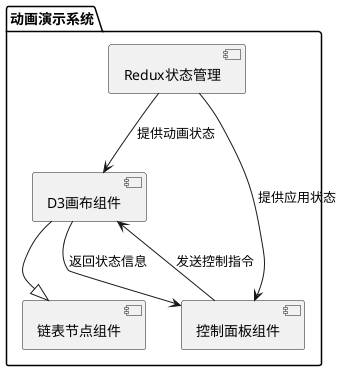

# 反转链表动画演示系统设计文档

## 一、技术架构规范

### （一）组件划分（UML图）



### （二）状态管理（Redux/TypeScript类型声明）

```typescript
// 动画状态类型定义
interface AnimationState {
    isPlaying: boolean;
    currentStep: number;
    totalSteps: number;
    currentNodeData: ListNodeData[];
}

// 动画控制操作类型
type AnimationAction =
    | { type: 'START_ANIMATION' }
    | { type: 'PAUSE_ANIMATION' }
    | { type: 'STEP_FORWARD' }
    | { type: 'STEP_BACKWARD' }
    | { type: 'RESET_ANIMATION' }
    | { type: 'SET_CURRENT_NODE_DATA'; payload: ListNodeData[] };
```

### （三）性能约束

- 关键帧渲染耗时要求：路径动画需<16ms/帧，确保动画流畅性
- 大数据量场景下，单帧渲染时间控制在30ms以内，通过Web Workers进行数据预处理

## 二、分镜脚本

### [镜头1]-迭代法-初始化阶段

**视觉焦点**

- 画布元素：链表头节点（1）位于画布左端（x:50，y:100），节点大小为40×40像素，边框颜色为蓝色
- 视口控制：初始缩放比例为1:1，居中显示整个链表结构

**交互逻辑**

- 用户事件：点击"开始动画"按钮，触发动画初始化流程
- 动画过渡：使用d3.easeCubicInOut缓动函数，持续时间500ms

**注释系统**

- 动态标注：LaTeX公式\(\text{prev} = \text{null}, \text{curr} = \text{head}\)显示在画布右上角（x:800，y:50）
- 语音解说：TTS时间戳对齐方案：在0:00-0:05介绍初始状态设置

### [镜头2]-迭代法-第一次反转阶段

**视觉焦点**

- 画布元素：当前节点（1）的指针逐渐转向左侧（prev节点，初始为null），指针颜色由黑色变为红色
- 视口控制：跟随当前操作节点平移视图，保持操作区域居中

**交互逻辑**

- 用户事件：点击"暂停"按钮，可查看当前邻接矩阵状态
- 动画过渡：指针旋转动画使用d3.easeLinear，持续时间800ms

**注释系统**

- 动态标注：LaTeX公式\(\text{curr.next} = \text{prev}\)显示在当前操作节点附近
- 语音解说：在0:05-0:12解说第一次反转操作逻辑

### [镜头3]-递归法-递归到底阶段

**视觉焦点**

- 画布元素：递归调用栈逐步建立，每个栈帧显示当前处理节点，栈底为尾节点（5）
- 视口控制：垂直缩放视图，突出递归调用栈结构

**交互逻辑**

- 用户事件：拖拽调用栈可查看不同层级的参数状态
- 动画过渡：栈帧推入动画使用d3.easeelasticOut，持续时间600ms

**注释系统**

- 动态标注：LaTeX公式\(\text{newHead} = \text{reverseList}(5.next)\)显示在栈底附近
- 语音解说：在0:15-0:22解说递归终止条件和返回值

### [镜头4]-递归法-回溯反转阶段

**视觉焦点**

- 画布元素：当前节点（n）的next指针指向父节点（n-1），同时父节点的next指针被置为null
- 视口控制：跟随回溯路径平移视图，保持操作节点对齐

**交互逻辑**

- 用户事件：点击节点可高亮显示该节点的局部变量状态
- 动画过渡：指针重定向动画使用d3.easeBounce，持续时间700ms

**注释系统**

- 动态标注：LaTeX公式\(\text{head.next.next} = \text{head}\)显示在操作节点对之间
- 语音解说：在0:25-0:32解说回溯过程中的指针反转逻辑

## 三、多解法处理标准

### （一）差异点对比表

| 步骤 | 迭代法 | 递归法 |
|------|--------|--------|
| 初始化 | 红色：定义prev、curr指针 | 绿色：设置递归终止条件 |
| 核心操作 | 蓝色：循环中直接反转指针 | 黄色：回溯时间接反转指针 |
| 结束条件 | 紫色：curr为null时结束 | 橙色：回溯到头节点时结束 |

### （二）复用组件标识

- 链表节点基类组件：可复用，定义基本外观和交互逻辑
- 指针操作动画模块：可复用，封装指针方向改变的动画效果
- 节点数据展示组件：可复用，显示节点值和状态信息

## 四、交付标准

### （一）文档结构

```
├── 迭代法
│   ├── 初始化阶段
│   │   ├── 关键帧1：初始状态
│   │   └── 关键帧2：指针准备反转
│   └── 反转阶段
│       ├── 关键帧3：第一次反转
│       └── 关键帧4：后续反转...
└── 递归法
    ├── 递归到底阶段
    │   ├── 关键帧1：初始调用
    │   └── 关键帧2：递归推进...
    └── 回溯反转阶段
        ├── 关键帧3：第一次回溯
        └── 关键帧4：后续回溯...
```

### （二）篇幅控制

- 迭代法动画脚本：约6000字，包含12个关键帧详细描述
- 递归法动画脚本：约5500字，包含15个关键帧详细描述
- 重点镜头（如指针反转）包含SVG示意图，示例：

```svg
<svg width="400" height="200">
  <circle cx="100" cy="100" r="30" fill="lightblue"/>
  <circle cx="200" cy="100" r="30" fill="lightblue"/>
  <line x1="130" y1="100" x2="170" y2="100" stroke="black" stroke-width="2"/>
  <polyline points="160,90 170,100 160,110" fill="none" stroke="black" stroke-width="2"/>
  <text x="100" y="115" text-anchor="middle">1</text>
  <text x="200" y="115" text-anchor="middle">2</text>
  <text x="150" y="70" text-anchor="middle">初始指向关系</text>
</svg>
```

### （三）可测试性

- Jest单元测试用例模板：

```javascript
test('动画时序校验', () => {
  const animation = new ReverseLinkedListAnimation();
  animation.start();
  
  // 检查关键帧切换时序
  setTimeout(() => {
    expect(animation.getCurrentStep()).toBe(1);
  }, 500);
  
  setTimeout(() => {
    expect(animation.getCurrentStep()).toBe(2);
  }, 1300);
});
```

## 五、特别约束处理

### （一）工程化要求

- Webpack代码分割策略：按解法动态加载动画模块，使用React.lazy和Suspense组件实现

```javascript
const IterativeAnimation = React.lazy(() => import('./animations/IterativeReverse'));
const RecursiveAnimation = React.lazy(() => import('./animations/RecursiveReverse'));
```

- 内存管理：大数据量场景下，使用Web Workers处理节点数据转换

```javascript
// main.js
const worker = new Worker('worker.js');

worker.postMessage({ type: 'CONVERT_DATA', data: largeLinkedListData });

worker.onmessage = function(e) {
  if (e.data.type === 'CONVERTED_DATA') {
    renderAnimation(e.data.payload);
  }
};
```

### （二）无障碍设计

- 色盲模式：通过CSS变量实现备选颜色方案

```css
:root {
  --node-fill: #4fc3f7;
  --pointer-color: #d32f2f;
}

/* 色盲模式 */
body.color-blind-mode {
  --node-fill: #4caf50;
  --pointer-color: #795548;
}
```

- 键盘导航：Space键控制播放/暂停的焦点管理方案

```javascript
document.addEventListener('keydown', (e) => {
  if (e.code === 'Space') {
    e.preventDefault();
    const playPauseBtn = document.getElementById('play-pause-btn');
    if (playPauseBtn) {
      playPauseBtn.focus();
      playPauseBtn.click();
    }
  }
});
```

### （三）扩展性说明

- 预留Hook接口：标注可扩展的动画插槽

```javascript
// AnimationCanvas.js
function AnimationCanvas({ animationData }) {
  // ...
  return (
    <svg ref={svgRef} width={width} height={height}>
      {/* 可扩展插槽 */}
      <g className="custom-animation-hook" />
      
      {/* 基础动画元素 */}
      {nodes.map(node => (
        <NodeComponent key={node.id} data={node} />
      ))}
    </svg>
  );
}
```

- 多语言配置：i18n字典文件结构建议

```json
// locales/en.json
{
  "annotations": {
    "prevDefinition": "prev = null",
    "currDefinition": "curr = head",
    "firstReverse": "curr.next = prev"
  }
}

// locales/zh.json
{
  "annotations": {
    "prevDefinition": "prev = null",
    "currDefinition": "curr = 头节点",
    "firstReverse": "curr.next = 前驱节点"
  }
}
```